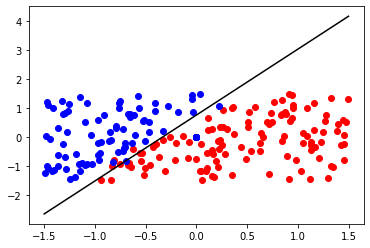
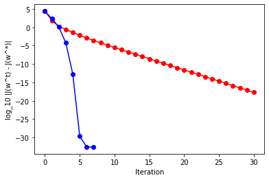
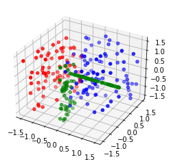
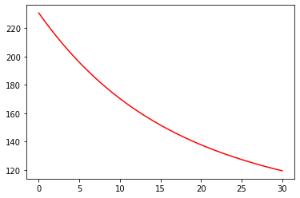

```python
import numpy as np
import matplotlib.pyplot as plt
from mpl_toolkits.mplot3d import Axes3D
```


```python
# Dataset 5
d = 5
n = 200
x = 3 * ( np.random.rand(n, d - 1) - 0.5 )
x = np.concatenate([x.T, np.ones((1, n))]) # 5次元にすべて常に1の入力を指定（定数用）
y = (2 * x[0] - x[1] + 0.5 + 0.5 * np.random.rand(n)) > 0
y = 2 * y - 1
```

    [[-2.02419739e-01  8.55959285e-01 -1.26836592e+00 -1.35600622e+00
      -2.00876592e-01  3.67353626e-01 -8.01720489e-01  6.66500812e-01
      -1.47858460e+00 -9.00274779e-01 -9.83856913e-01 -8.48791378e-01
       1.92133063e-01 -8.47437185e-01 -5.95457495e-01 -6.50374982e-01
       2.79716495e-01  6.00555159e-01  1.75412235e-01 -3.27976034e-01
      -5.10262897e-01  7.28837734e-01  1.42900624e+00  1.32990212e+00
      -4.91330293e-01  1.14090170e+00 -1.94914212e-01 -1.29488538e+00
      -5.24896986e-01  2.78158095e-01 -6.59950965e-01  6.58067687e-01
       2.01354253e-01  1.68299799e-01  2.94904222e-01 -1.59332683e-01
       1.16495898e+00 -6.82152436e-01  1.35896188e+00 -3.20602935e-01
      -4.13850844e-01 -9.94868767e-01 -6.10689736e-01  1.03544243e+00
      -1.30598219e+00  1.35046367e+00  1.37506878e-01 -6.19316325e-01
      -4.22740116e-01 -2.71931022e-01 -1.13833126e-01 -8.98714895e-01
       6.44520371e-02 -8.75218039e-01 -4.54721688e-01  9.07469258e-01
      -1.49189338e+00  3.40782981e-01  5.68666941e-01 -1.31502116e+00
       3.80758106e-01  1.18794352e+00 -1.87184255e-01 -6.60162611e-01
       1.11218758e+00 -2.90905078e-01 -1.34878219e+00  5.02109856e-01
      -1.15738559e+00 -1.74741467e-01  4.40255695e-01 -1.40348587e+00
      -1.33871821e+00 -1.38462686e+00  2.83638545e-01 -3.44273116e-01
       6.66791824e-01 -1.13499326e+00  9.10633702e-01  7.05349802e-01
       1.12616534e-01 -6.46740143e-01 -1.25217767e+00  1.30418612e+00
       1.12738259e+00  6.84271574e-01 -6.08887243e-01 -1.56327682e-01
       1.41078041e+00  1.31077608e+00 -7.53631068e-01  3.89758115e-01
       5.13717940e-01 -1.78870540e-01  1.06981626e-02 -6.50904626e-01
      -7.95979747e-01 -1.24890224e+00 -1.49596487e+00 -1.19494405e+00
      -4.86826167e-01  9.27720761e-01 -1.39657408e+00  1.33687988e+00
       1.41859014e+00  2.94601477e-01 -1.45849023e+00 -3.99912738e-02
       1.25833807e+00 -1.34665051e+00  1.18720283e+00  9.57921688e-01
       3.45722366e-01  8.66290016e-04 -4.66638016e-01  1.47259175e+00
      -9.03345621e-01 -5.91209089e-01 -2.43747357e-02 -3.37039027e-01
      -4.41182752e-01  1.28621095e+00 -6.59357190e-01 -1.00214375e+00
       1.44913315e+00  2.74285562e-01  1.02794069e+00  3.91015762e-01
      -1.49134554e+00  9.30548464e-01  9.04869551e-01 -1.06646087e+00
      -2.02288614e-01  4.87957200e-01 -4.29507629e-01  3.97163350e-01
      -8.22668253e-02  9.51207247e-01  3.10735481e-03  7.43408140e-01
      -1.37342731e+00  6.26501856e-01  1.10134323e+00  7.11270674e-01
      -8.63875232e-02 -9.38949888e-01 -1.28084102e+00  1.27417111e+00
      -2.04372023e-02  1.19071447e+00 -2.62372735e-01 -5.94898809e-01
      -1.29633584e+00 -1.04006492e+00  1.31503132e+00  4.24467144e-01
      -1.52329919e-01  8.56055681e-01  1.32060280e+00 -1.41867154e+00
      -1.18261214e+00 -4.00958059e-02 -1.29049233e+00  2.85625378e-01
       1.10351799e-02 -8.92226277e-01 -1.36615348e+00 -8.08746917e-01
      -8.63598345e-02 -8.77501915e-01 -9.45792100e-01 -6.52453763e-01
      -5.65586720e-01  7.16308469e-01 -2.60458842e-01 -2.46056548e-01
       8.25943795e-01  6.69754667e-01 -1.26835357e+00  8.35616342e-01
      -1.23863981e+00  1.40543292e+00 -1.00746725e+00 -1.28177198e+00
       1.25442677e+00  5.27173708e-01  1.22608764e+00 -1.19352678e+00
       1.89221517e-01  8.99505849e-01  6.10048185e-01 -5.68121471e-01
       2.97790503e-01 -1.25604012e+00  1.13054265e+00  7.25221568e-01
       1.27454004e+00  6.15267445e-02 -8.12747829e-01  2.64170134e-01]
     [ 5.91831145e-01  1.27420123e+00 -6.59392598e-02  4.85521007e-01
       1.15963458e+00 -1.30466475e+00 -3.44658774e-01  2.30768857e-01
      -3.84536343e-01  8.25858634e-01  1.05464311e+00  5.04672280e-01
       3.73066759e-01  8.11511486e-01 -7.58637374e-01  5.43471317e-01
       2.60584128e-01 -1.23689472e+00 -6.36199255e-01 -9.57547705e-01
      -1.45347918e-01 -8.68781619e-01 -1.07663455e+00  7.84533405e-01
       6.50753435e-02  1.49870505e+00 -6.75611726e-01  1.20991899e+00
       1.43873436e+00  1.44885030e+00 -9.56496416e-01 -6.27676053e-01
      -1.08354319e+00 -1.26279956e-01  1.38971363e+00  6.41586071e-01
       1.17151159e+00  7.86641140e-01 -5.87080970e-01  9.78835703e-01
      -9.25238663e-01 -4.14987736e-01  7.91379576e-01 -9.75076068e-01
      -7.32137945e-01 -1.29712942e+00 -1.90761940e-01  7.81679854e-01
      -1.61883912e-01 -1.14579822e+00 -2.92748167e-01  1.46742959e+00
       9.79455739e-01  1.38060301e+00  1.03784057e+00  9.27932059e-01
      -1.40716401e+00  3.37934514e-01 -1.65945741e-01 -1.00090250e+00
      -1.24337706e+00 -7.23079652e-01 -7.83454149e-01  1.01867484e+00
      -2.88722306e-01 -9.48833755e-01  6.58902273e-01  6.12219213e-01
      -4.77660189e-01 -1.34746908e+00 -5.52270312e-01  1.01561227e+00
       1.27625330e-01 -1.15963079e+00 -7.37629983e-01 -8.96493796e-01
       4.90250279e-01  1.31159822e+00 -1.72703888e-01 -5.54011809e-01
      -2.68615353e-01  6.61397469e-01 -1.45285216e+00 -1.98853289e-01
       1.18896032e-01 -5.17269324e-01 -1.10068171e+00 -3.72492387e-01
      -5.92647932e-01 -9.25363432e-01 -5.79648088e-01 -1.46939438e+00
      -8.38433367e-01  8.24699482e-01  9.87504307e-01  1.43575330e+00
       5.16327541e-01  1.45719255e+00 -9.75950571e-01  5.49523317e-01
       9.75888147e-01 -1.90438469e-01 -3.16098201e-01 -1.62709610e-01
      -2.53584924e-01 -1.46687111e+00  8.80177275e-01 -1.28791796e+00
      -9.60923111e-01 -8.12909818e-01  4.76402368e-01 -1.13948698e+00
      -1.04735261e-01 -1.65023708e-01 -8.82538402e-01  3.75663805e-01
       1.30341595e+00  6.21838138e-01  1.11712287e+00  1.01716199e+00
       6.11039521e-01 -1.36045774e+00  8.52391278e-01  3.23435762e-01
      -4.12676985e-01  3.31580314e-01 -1.06186199e+00  1.39039565e+00
       7.56863462e-01 -6.41981201e-01 -1.47660775e+00  1.11953907e+00
      -9.81537107e-01  1.37657808e+00  1.48932585e-01  6.17329698e-01
      -1.61137342e-01 -1.24567916e+00  1.48838473e+00  1.70843136e-01
      -8.87367915e-01  4.91436877e-01 -3.59066152e-01  1.76587777e-02
       4.20494066e-02  9.05632891e-01  5.59309508e-01  1.18574943e+00
       6.55362104e-01 -7.28584399e-01  1.38633828e+00 -5.89082066e-01
      -6.01673436e-02  1.47890609e+00 -2.13598752e-01 -1.11191945e+00
       1.48896338e+00 -1.09655160e+00  3.24651137e-01 -1.27071997e+00
       5.39797690e-01  6.42308475e-01  3.59552973e-01  8.18623118e-02
       4.37362081e-02 -8.29904507e-01  9.08030734e-01  8.88029490e-01
      -6.72146474e-01  1.43651915e+00 -6.95220400e-01  7.99145472e-01
      -1.07441959e+00 -6.06941317e-01 -8.82414890e-01  2.21870805e-01
       9.14437608e-01 -8.53769570e-02 -1.29707736e+00 -2.75109828e-01
       2.69177180e-01  8.62021814e-01 -5.76994649e-01 -1.39246410e+00
       4.21290069e-01 -1.26290592e+00  5.21501355e-01  2.14672350e-02
       8.42091116e-02 -6.71877874e-01  6.39816485e-01  1.15013413e+00
      -1.48069497e+00  4.77564896e-01 -1.24860208e+00 -6.60182942e-01
      -6.51130708e-01  5.29340321e-01 -7.36607375e-02  6.83074475e-01]
     [ 1.16989173e+00  9.93285188e-01 -5.07332257e-01  1.35787870e+00
      -6.52357784e-01  5.43847215e-01  1.09805668e+00  3.60109551e-01
       9.74828166e-02 -4.75507518e-01  1.00676670e+00 -1.14465492e-01
       4.10961920e-01  2.27894736e-01 -9.71160594e-01 -1.44580338e-01
      -8.19811720e-01 -6.24720653e-01  4.66122941e-01 -1.27224523e+00
      -1.21055763e+00 -1.27487256e+00  6.67110500e-02 -2.16822629e-01
       6.22700972e-01 -1.23027347e+00 -5.53102150e-01  1.24117117e+00
       1.42841635e+00  9.20823097e-01 -1.33629334e+00 -9.07258833e-02
       5.68409247e-01 -1.26287920e+00 -1.18922321e+00  6.20172444e-01
       5.34300875e-01 -8.93540839e-01  2.63013624e-01 -7.37826282e-01
       9.37397008e-01 -1.16336366e+00 -6.86531796e-01  5.93526142e-01
       7.69094267e-01 -6.31927868e-01 -7.59107893e-01 -2.90535883e-01
       5.27228690e-01 -1.46768808e+00  3.09952224e-01  9.56935834e-01
       1.42132761e+00  3.04676520e-01  4.80325259e-01 -8.95360659e-01
       1.08244221e+00  1.36330683e+00 -1.25371543e+00 -2.52488420e-01
      -1.06390812e+00  3.89880407e-02  1.44346248e+00 -1.07222557e+00
      -7.27410147e-01 -1.58598260e-01 -6.57047720e-01 -3.55896660e-01
       6.12245968e-01 -1.32317474e+00 -7.43152088e-01  1.17206195e-01
      -5.66103966e-01  9.37231278e-01 -8.23587882e-01 -1.37753567e+00
      -8.25855059e-01 -1.00809140e+00 -7.59100445e-01 -9.74311182e-01
      -7.35497388e-01  8.92908277e-01 -9.80038546e-01  1.14199789e+00
       7.82278432e-01  5.26162406e-01 -1.28785817e+00  1.07665619e+00
       1.43116604e+00 -1.17845619e+00  5.01477597e-01 -2.42138526e-01
       9.04252081e-01 -1.47329258e+00  9.78056438e-01  1.41956076e+00
      -6.01955945e-02  5.86557837e-01 -1.84797069e-02 -1.35089539e+00
      -1.14288603e+00  1.23456796e+00 -8.68177332e-02 -3.57103027e-01
      -1.03457253e+00  5.41078881e-01  6.02881552e-01  1.00135878e+00
       6.52650352e-01 -1.18953916e+00 -3.89854447e-01  5.38326136e-01
       3.70214998e-01 -8.86914428e-01  9.54208046e-01 -1.48215532e+00
       1.15929680e+00 -1.06844727e-01 -3.26591776e-01 -6.95996319e-01
       4.37184047e-01 -1.45969777e+00 -1.75752316e-01  8.68606979e-01
       1.77346386e-01 -8.80931716e-01  1.79135011e-03  9.18064415e-01
       7.62688015e-01 -8.32799539e-01 -1.05283791e-01 -1.34737251e+00
      -1.08983642e+00  2.38154531e-01 -5.11365187e-01  4.73403261e-01
      -1.17252119e+00  2.91856547e-03 -1.10084311e+00  1.50982469e-01
       1.97532477e-01 -2.80226203e-01  2.65655478e-01  1.02910177e+00
       2.36291452e-01 -7.03399583e-01  1.37299411e+00  1.44597729e+00
       4.64169245e-01 -4.89376078e-01 -1.90114545e-01 -1.38612805e+00
       9.95322182e-01 -5.21403272e-01 -1.48016619e+00  1.27862995e+00
       4.12360312e-01 -5.52070321e-01 -1.13797349e+00  8.77618290e-01
       1.13354068e+00 -8.50351536e-01 -2.17034063e-03  1.08227921e+00
      -6.10491306e-01  5.70057621e-01  4.17584707e-01 -1.03320098e-01
      -6.81570734e-01  8.14035491e-01 -1.23842908e+00  1.23970671e+00
       1.30785215e+00  1.65703904e-01 -1.13621824e+00  7.50998520e-01
       1.49830776e+00 -1.28137316e+00  1.21762132e+00  2.18216505e-01
       7.42002385e-01  8.92000521e-01  1.38591143e-01  1.15260654e+00
      -6.95103984e-01  6.96337621e-01  5.11907263e-01  1.36784271e+00
       1.31282795e+00  7.87632759e-01  8.62648398e-01  9.66625023e-01
      -1.29984577e+00 -1.45234134e+00 -9.11915603e-01 -8.81755116e-01
       3.37200870e-01  9.26093819e-01  1.97238226e-02  1.72414973e-02]
     [-9.77304340e-01  3.29754421e-01  5.42181027e-01  9.35051516e-01
      -5.39175843e-01  1.27816701e+00 -9.15064904e-02  7.89327785e-01
       1.86802314e-01 -5.28813458e-01  3.02559197e-01 -1.45956520e+00
       4.25900196e-01 -7.56216740e-01 -1.25478065e+00  6.79542540e-01
       4.07064370e-02  6.73213175e-01  1.34001328e+00  1.43400908e+00
       6.34426007e-01  2.73880614e-01  7.75932186e-01 -8.37173607e-02
       3.09562292e-01 -2.01081334e-01  8.30449718e-01  1.19683654e+00
      -7.58200597e-01 -1.32250425e+00 -5.72675952e-01 -1.49634291e+00
      -1.06930896e+00  1.05883793e+00  9.63317822e-03  9.68483967e-01
       9.42142888e-01  1.11912936e+00  6.99707903e-01  3.50059137e-01
      -1.44372238e+00  1.22956350e-01 -2.34073159e-01 -1.45273354e+00
      -2.87868013e-01  1.48195411e-01 -1.47622731e+00  6.38064381e-01
      -7.77381646e-01 -9.31523447e-01 -5.93259008e-01 -9.94135564e-01
      -2.28042413e-01  3.55262144e-01 -7.95022509e-01  2.56920475e-01
       1.40303227e+00 -3.30046824e-01  1.13961859e+00 -2.88141597e-01
       1.44686790e+00 -9.63932398e-01  1.32004873e+00 -7.30360538e-01
       2.42882825e-01 -7.48433331e-01 -6.14385515e-02  4.25114850e-01
      -3.46596710e-01  1.48819837e-01 -8.50518485e-02 -1.24420169e+00
       1.26476944e+00  4.94534997e-01 -9.78497873e-01  4.20039052e-01
       9.85683196e-01  9.56706335e-01 -3.99032763e-01 -2.52018294e-01
       7.75435344e-01 -1.16140863e+00  6.30323504e-01 -8.19995748e-01
      -5.29132742e-01  9.95487883e-01 -1.29541089e+00  4.07891083e-01
       1.49366946e+00 -4.17587616e-02 -2.70291527e-01 -1.00984418e+00
       8.38486950e-01  1.28806848e-01  1.72889412e-01  9.15858924e-01
      -1.48935148e+00  4.55579365e-01 -2.99901566e-01  1.34235420e+00
       1.28597297e+00 -1.49806421e+00  4.11048741e-01 -8.09532020e-01
       9.80843499e-01  1.25160299e+00 -8.37420516e-02  1.86812913e-02
       8.82597015e-01 -2.18923702e-01  1.01138398e+00  5.09619131e-01
       1.40044440e+00 -2.42821274e-01 -2.89831942e-01  6.46796106e-02
      -9.73158159e-01  5.15568283e-01 -8.24753900e-01  7.71734795e-01
      -9.46978094e-01 -4.77276476e-01 -6.84909295e-01 -1.44113542e+00
      -4.85325027e-01  8.50401997e-01 -4.75885004e-01  4.60702884e-01
      -6.99325386e-01 -1.08588125e-01  1.24246379e+00 -5.98573183e-01
      -2.54296625e-01 -7.32413972e-01 -1.40778597e+00  4.24534115e-01
       1.09165542e-03 -7.19913716e-01  2.00713689e-01  5.97204802e-02
      -2.13239056e-01  1.11922838e+00 -5.10237135e-01 -8.80014081e-01
      -1.40277516e+00  9.80615682e-01 -4.34283078e-01 -9.17514001e-01
      -8.88652785e-02 -9.74972344e-01  6.46577419e-01 -2.56375433e-01
       4.91714141e-01 -4.58212033e-01  1.34872831e+00  6.64760316e-01
      -1.47984967e+00 -4.52274696e-01 -6.88446982e-01 -1.26708508e+00
       6.77028984e-01  8.50671980e-01  5.51184912e-01  1.90504760e-01
       1.46904658e+00 -1.03456172e+00  6.94767768e-01 -1.55797638e-02
      -6.46132840e-02 -3.16838196e-01  1.39790603e-01  2.36853832e-01
      -1.27021335e+00  6.62511056e-01 -1.48970780e+00  8.43655066e-02
       1.43182236e+00  9.70362558e-01  4.71037516e-01 -1.00456813e-01
      -3.70118781e-01 -5.31879627e-01 -1.52940925e-01  1.31660922e+00
       1.20936059e+00 -1.11940980e+00  3.34479577e-01  4.49089452e-01
       3.86079902e-02  1.03067930e+00 -5.26024109e-01 -8.12728053e-01
       1.32720357e+00 -1.38423667e+00  8.36126606e-01 -5.94184709e-01
       1.38455505e+00  1.14949749e+00 -5.31307575e-01 -1.35682930e+00]
     [ 1.00000000e+00  1.00000000e+00  1.00000000e+00  1.00000000e+00
       1.00000000e+00  1.00000000e+00  1.00000000e+00  1.00000000e+00
       1.00000000e+00  1.00000000e+00  1.00000000e+00  1.00000000e+00
       1.00000000e+00  1.00000000e+00  1.00000000e+00  1.00000000e+00
       1.00000000e+00  1.00000000e+00  1.00000000e+00  1.00000000e+00
       1.00000000e+00  1.00000000e+00  1.00000000e+00  1.00000000e+00
       1.00000000e+00  1.00000000e+00  1.00000000e+00  1.00000000e+00
       1.00000000e+00  1.00000000e+00  1.00000000e+00  1.00000000e+00
       1.00000000e+00  1.00000000e+00  1.00000000e+00  1.00000000e+00
       1.00000000e+00  1.00000000e+00  1.00000000e+00  1.00000000e+00
       1.00000000e+00  1.00000000e+00  1.00000000e+00  1.00000000e+00
       1.00000000e+00  1.00000000e+00  1.00000000e+00  1.00000000e+00
       1.00000000e+00  1.00000000e+00  1.00000000e+00  1.00000000e+00
       1.00000000e+00  1.00000000e+00  1.00000000e+00  1.00000000e+00
       1.00000000e+00  1.00000000e+00  1.00000000e+00  1.00000000e+00
       1.00000000e+00  1.00000000e+00  1.00000000e+00  1.00000000e+00
       1.00000000e+00  1.00000000e+00  1.00000000e+00  1.00000000e+00
       1.00000000e+00  1.00000000e+00  1.00000000e+00  1.00000000e+00
       1.00000000e+00  1.00000000e+00  1.00000000e+00  1.00000000e+00
       1.00000000e+00  1.00000000e+00  1.00000000e+00  1.00000000e+00
       1.00000000e+00  1.00000000e+00  1.00000000e+00  1.00000000e+00
       1.00000000e+00  1.00000000e+00  1.00000000e+00  1.00000000e+00
       1.00000000e+00  1.00000000e+00  1.00000000e+00  1.00000000e+00
       1.00000000e+00  1.00000000e+00  1.00000000e+00  1.00000000e+00
       1.00000000e+00  1.00000000e+00  1.00000000e+00  1.00000000e+00
       1.00000000e+00  1.00000000e+00  1.00000000e+00  1.00000000e+00
       1.00000000e+00  1.00000000e+00  1.00000000e+00  1.00000000e+00
       1.00000000e+00  1.00000000e+00  1.00000000e+00  1.00000000e+00
       1.00000000e+00  1.00000000e+00  1.00000000e+00  1.00000000e+00
       1.00000000e+00  1.00000000e+00  1.00000000e+00  1.00000000e+00
       1.00000000e+00  1.00000000e+00  1.00000000e+00  1.00000000e+00
       1.00000000e+00  1.00000000e+00  1.00000000e+00  1.00000000e+00
       1.00000000e+00  1.00000000e+00  1.00000000e+00  1.00000000e+00
       1.00000000e+00  1.00000000e+00  1.00000000e+00  1.00000000e+00
       1.00000000e+00  1.00000000e+00  1.00000000e+00  1.00000000e+00
       1.00000000e+00  1.00000000e+00  1.00000000e+00  1.00000000e+00
       1.00000000e+00  1.00000000e+00  1.00000000e+00  1.00000000e+00
       1.00000000e+00  1.00000000e+00  1.00000000e+00  1.00000000e+00
       1.00000000e+00  1.00000000e+00  1.00000000e+00  1.00000000e+00
       1.00000000e+00  1.00000000e+00  1.00000000e+00  1.00000000e+00
       1.00000000e+00  1.00000000e+00  1.00000000e+00  1.00000000e+00
       1.00000000e+00  1.00000000e+00  1.00000000e+00  1.00000000e+00
       1.00000000e+00  1.00000000e+00  1.00000000e+00  1.00000000e+00
       1.00000000e+00  1.00000000e+00  1.00000000e+00  1.00000000e+00
       1.00000000e+00  1.00000000e+00  1.00000000e+00  1.00000000e+00
       1.00000000e+00  1.00000000e+00  1.00000000e+00  1.00000000e+00
       1.00000000e+00  1.00000000e+00  1.00000000e+00  1.00000000e+00
       1.00000000e+00  1.00000000e+00  1.00000000e+00  1.00000000e+00
       1.00000000e+00  1.00000000e+00  1.00000000e+00  1.00000000e+00
       1.00000000e+00  1.00000000e+00  1.00000000e+00  1.00000000e+00]]


```python
lam = n / 2 * 0.01

def exp(omega):
    return np.exp(- y * np.dot(omega, x))

def J(omega):
    l = np.sum(np.log(1 + exp(omega)))
    return l + lam * np.dot(omega, omega)

def gradJ(omega):
    return np.sum(exp(omega) / (1 + exp(omega)) * (-y * x), 1) + 2 * lam * omega

def gradGradJ(omega):
    c = exp(omega) / ((1 + exp(omega)) * (1 + exp(omega)))
    sum = np.zeros((d, d))
    for i in range(n):
        xi = x.T[i].reshape(d, 1)
        sum += c[i] * np.dot(xi, xi.T)
    return sum + 2 * lam * np.identity(d)

def plot(omega):
    X = np.array([-1.5, 1.5])
    Y = -omega[0] / omega[1] * X - omega[d - 1] / omega[1]
    plt.scatter(x[0] * (y + 1) / 2  , x[1] * (y + 1) / 2,   c="red")
    plt.scatter(x[0] * (y - 1) / -2 , x[1] * (y - 1) / -2,  c="blue")
    plt.plot(X, Y, c="black")
```


```python
maxEvals = 30
omega0 = np.random.rand(d)

# batch steepest gradient method
def steepestGradient():
    omega = omega0.copy()
    alpha = 0.05
    omegaSeries = [omega0.copy()]
    for i in range(maxEvals):
        grad = gradJ(omega)
        omega -= alpha * grad
        omegaSeries.append(omega.copy())
    plot(omega)
    return omegaSeries

# newton method
def newton():
    omega = omega0.copy()
    omegaSeries = [omega0.copy()]
    for i in range(maxEvals):
        grad = gradJ(omega)
        gradGrad = gradGradJ(omega)
        omega -=  np.dot(np.linalg.inv(gradGrad), grad)
        omegaSeries.append(omega.copy())
    plot(omega)
    return omegaSeries
```


```python
newtonOmegaSeries = newton();
```


    

    


```python
steepestGradientOmegaSeries = steepestGradient();
```


    

    


```python
opt = min([J(steepestGradientOmegaSeries[-1]), J(newtonOmegaSeries[-1])])
steepestGradientPerformances = []
newtonPerformances = []
for index in range(maxEvals + 1):
    steepestGradientPerformances.append(np.log(np.linalg.norm(J(steepestGradientOmegaSeries[index])) - opt))
    newtonPerformances.append(np.log(np.linalg.norm(J(newtonOmegaSeries[index]) - opt)))
```

    /tmp/ipykernel_239258/4105209108.py:6: RuntimeWarning: divide by zero encountered in log
      newtonPerformances.append(np.log(np.linalg.norm(J(newtonOmegaSeries[index]) - opt)))


```python
plt.xlabel('Iteration')
plt.ylabel('log_10 |J(w^t) - J(w^*)|')   
plt.plot(range(maxEvals + 1), steepestGradientPerformances, c="red", marker = 'o')
plt.plot(range(maxEvals + 1), newtonPerformances, c="blue", marker = 'o')
```


    [<matplotlib.lines.Line2D at 0x7f80c67cc880>]


    

    


```python
# Dataset 6
n = 200
d = 5
C = 3
x = 3 * ( np.random.rand(n, d - 1) - 0.5 )
W = np.array([[2, -1, 0.5], [-3, 2, 1], [1, 2, 3]])
logit = np.dot(np.insert(x[:, 0:C-1], C-1, 1, axis=1), W.T) + 0.5 * np.random.rand(n, C)
maxlogit = np.max(logit, axis=1)
y = np.argmax(logit, axis=1)
x = np.insert(x, d - 1, 1, axis=1)

fig = plt.figure()
ax = fig.add_subplot(projection='3d')
ax.scatter(x[:, 0] * (y == 2), x[:, 1] * (y == 0), x[:, 2] * (y == 0),  c="green")
ax.scatter(x[:, 0] * (y == 1), x[:, 1] * (y == 1), x[:, 2] * (y == 1),  c="red")
ax.scatter(x[:, 0] * (y == 2), x[:, 1] * (y == 2), x[:, 2] * (y == 2),  c="blue")
```


    <mpl_toolkits.mplot3d.art3d.Path3DCollection at 0x7f086e6da3d0>


    

    


```python
lam = n / 2 * 0.01

def exp(omega_c, xi):
    return np.exp(np.dot(omega_c, xi))

def exp_sum(omega, xi):
    return np.sum(np.exp(np.dot(omega, xi)))

def J(omega):
    l = 0
    for index in range(n):
        xi = x[index]
        yi = y[index]
        l += - np.dot(omega[yi], xi) + np.log(exp_sum(omega, xi))
    d = 0
    for c in range(C):
        d += np.dot(omega[c], omega[c])
    return l + lam * d

def gradJ(omega, targetY):
    lGrad = np.zeros((d))
    for index in range(n):
        xi = x[index]
        yi = y[index]
        if targetY == yi:
            lGrad -= xi
            lGrad += exp(omega[yi], xi) / exp_sum(omega, xi) * xi
    return lGrad + 2 * lam * omega[targetY]

def gradGradJ(omega, targetY):
    lGradGrad = np.zeros((d, d))
    for index in range(n):
        xi = x[index]
        yi = y[index]
        if targetY == yi:
            lGradGrad += exp(omega[yi], xi) * (exp_sum(omega, xi) - exp(omega[yi], xi)) / (exp_sum(omega, xi) ** 2) * np.dot(xi.reshape(d, 1), xi.reshape(1, d))
    return lGradGrad + 2 * lam * np.identity(d)
```


```python
maxEvals = 30
omega0 = np.random.rand(C, d)

# batch steepest gradient method
def steepestGradient():
    omega = omega0.copy()
    alpha = 0.001
    omegaSeries = [omega0.copy()]
    for i in range(maxEvals):
        orgOmega = omega.copy()
        for yTarget in range(C):
            grad = gradJ(orgOmega, yTarget)
            omega[yTarget] -= alpha * grad
        omegaSeries.append(omega.copy())
    return omegaSeries

# newton method
def newton():
    omega = omega0.copy()
    omegaSeries = [omega0.copy()]
    for i in range(maxEvals):
        orgOmega = omega.copy()
        for yTarget in range(C):
            grad = gradJ(orgOmega, yTarget)
            gradGrad = gradGradJ(orgOmega, yTarget)
            omega[yTarget] -=  np.dot(np.linalg.inv(gradGrad), grad)
        omegaSeries.append(omega.copy())
    return omegaSeries


pSteepestGradient = []
for omega in steepestGradient():
    pSteepestGradient.append(J(omega))

pNewton = []
for omega in newton():
    pNewton.append(J(omega))

plt.plot(range(maxEvals + 1), pSteepestGradient, c="red")
# plt.plot(range(maxEvals + 1), pNewton, c="blue")

```


    [<matplotlib.lines.Line2D at 0x7f0867d5d4f0>]


    

    

